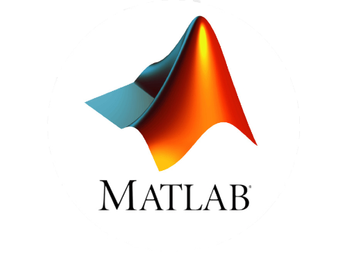
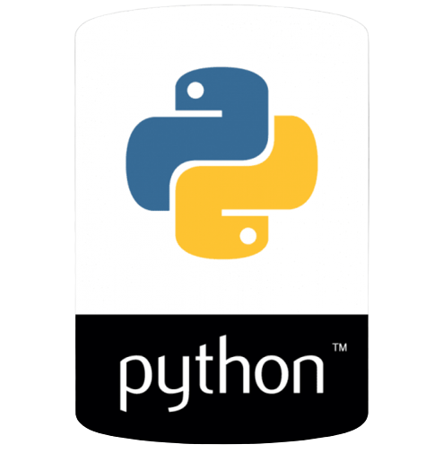
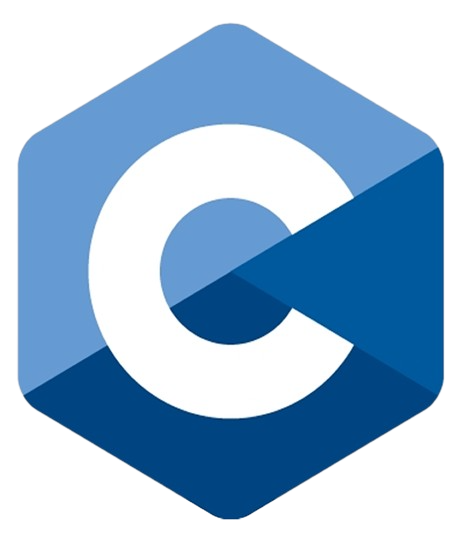
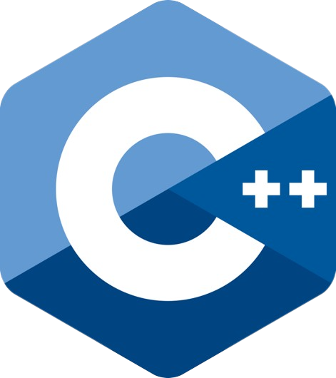
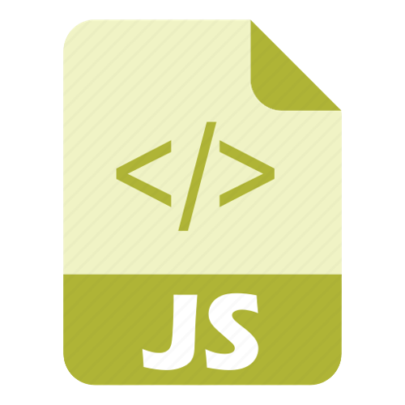

<body>
    <h1>Welcome 👋</h1>
    <h2>GitHub by José Sávyo    
    <ul>
    <li>Electrical Engeineering Studant</li>
    <li>Reasearcher in the area of control, Analysis and Design of Mechanical Systems, acquisition, analyis and data processing</li>
    </ul>  
    </h2>
    <h2>Programming Languages   
        

            
            
            
            
            
        

        </h2>
    <h2>Recent Researches  
    <ul>
    <li>Aplicação de microcontroladores de baixo custo no desenvolvimento de um analisador modular: Módulo de medição de rotações e balanceamento 2021/2022 (Finished)</li>
    <li>Aperfeiçoamento do Analisador Modular de Baixo Custo em Desenvolvimento 2022/2023</li>
    <li>Aplicabilidade da Manufatura Aditiva por Soldagem a Arco na Fabricação de Componentes Metálicos de Simples, Média e Alta Complexidade Utilizados no Setor Aeronáutico 2023</li>
    </ul> 
    </h2>

<h2 align="center">Social Contacts   
        

        
         
        

    </h2> </body>
